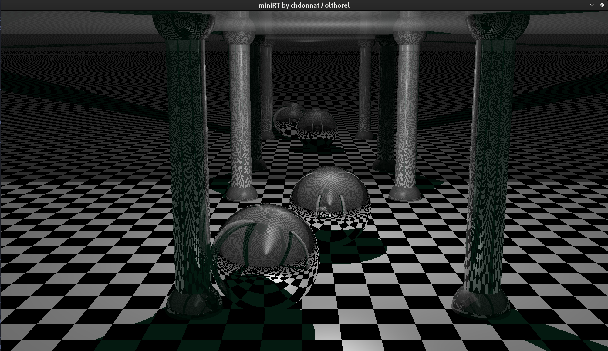
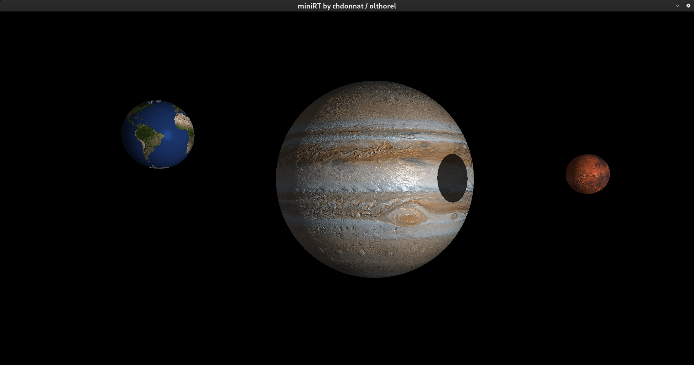

# 🌐 MiniRT - Projet 42

Par chdonnat (Christophe Donnat) et olthorel (Olivier Thorel) de 42 Perpignan, France





---

## BUT DU PROJET :

L'objectif du projet miniRT est de créer un petit ray tracer en temps réel capable de générer le rendu de scènes 3D décrites dans un format texte simple.
Le programme doit générer une image réaliste en utilisant des objets géométriques de base, un éclairage et une configuration de caméra, puis afficher le résultat dans une fenêtre graphique.

D'un point de vue pédagogique, miniRT est une introduction à l'informatique graphique.
Il permet aux étudiants de comprendre les principes fondamentaux du ray tracing, y compris les mathématiques vectorielles, les transformations de caméra et l'interaction lumière/surface.
Il met également l'accent sur une structure de code propre, le raisonnement géométrique et l'importance des performances dans les systèmes de rendu.

### PARTIE BONUS :

- Ajouter un nouveau type d'objet : cônes, cubes, etc.
- Implémenter l'éclairage spéculaire (Phong Lighting)
- Implémenter la gestion de plusieurs sources lumineuses et des lumières colorées
- Gérer les textures et le bump mapping
- Implémenter un damier (checkerboard)

## QUELQUES COMMANDES UTILES :

compiler le programme et supprimer les fichiers .o :

	make && make clean

exécuter le programme avec un fichier .rt (représentant une scène) en argument

	./minirt <fichier_scene.rt>
 
par exemple, vous pouvez utiliser le fichier Uranus_Neptune_Jupiter_Venus.rt dans le répertoire scenes/mandatory_scenes

	./minirt scenes/mandatory_scenes/Uranus_Neptune_Jupiter_Venus.rt

compiler le programme bonus et supprimer les fichiers .o :

	make bonus && make clean

exécuter le programme bonus avec un fichier .rt (représentant une scène) en argument

	./minirt_bonus <fichier_scene.rt>
 
par exemple, vous pouvez utiliser le fichier Earth_Mars_Jupiter.rt dans le répertoire scenes/bonus_scenes

	./minirt_bonus scenes/bonus_scenes/Earth_Mars_Jupiter.rt


## ARCHITECTURE :

- Répertoire dclst/ : fonctions et header pour l'utilisation de listes doublement chaînées circulaires
- Répertoire include/ : pour les headers
- Répertoire libft/ : contient la libft (+ get_next_line et ft_printf)
- Répertoire scenes/ : scènes à utiliser en argument du programme
	- Répertoire invalid_scenes/ : fichiers de scènes invalides
	- Répertoire mandatory_scenes/ : fichiers de scènes valides pour l'exécutable de la partie obligatoire
	- Répertoire bonus_scenes/ : fichiers de scènes valides pour l'exécutable bonus
- Répertoire mandatory/ : contient la partie obligatoire du projet
- Répertoire bonus/ : pour la partie bonus
- Makefile (avec les règles : make bonus clean fclean re)
- readme.md : explications et commandes principales du projet

## APERÇU DU PROJET (partie obligatoire) :

Pour construire un ray tracer fonctionnel comme **miniRT**, le processus de rendu suit ces étapes principales :

### 1. Parsing de la Scène

- Lire la description de la scène depuis un fichier `.rt`.
- Extraire les objets (sphères, plans, cylindres...), les lumières et les paramètres de la caméra.
- Stocker tous les éléments dans des structures de données appropriées.

### 2. Configuration du Viewport

Construire le viewport dans l'espace 3D en utilisant un système de coordonnées local à la caméra, basé sur les paramètres suivants :

- Origine et direction  
- FOV horizontal (donné en degrés → doit être converti en radians)  
- Distance au viewport (fixée à 1 par défaut)  
- Résolution de l'image (`ResX × ResY`)

Les étapes suivantes détermineront, pour chaque point du viewport, quelle couleur assigner au pixel correspondant dans l'image finale.

### 3. Lancer de Rayons (Ray Casting) (Par Pixel)

Pour chaque pixel de l'image de sortie :

- Calculer les coordonnées normalisées `(u, v)` sur le viewport  
- Générer un rayon depuis l'origine de la caméra passant par le point correspondant sur le viewport  
- Normaliser la direction du rayon

### 4. Intersection Rayon-Objet

Vérifier si le rayon coupe un objet de la scène :

- Conserver le point d'intersection le **plus proche** (s'il y en a un)  
- Pour chaque type d'objet (sphère, plan, cylindre...), implémenter une fonction d'intersection spécifique

### 5. Éclairage et Ombrage (Lighting & Shading)

- Si le rayon ne touche rien, assigner la couleur de fond au pixel (noir) 
- Si le rayon touche un objet :
  - Calculer la **normale à la surface** au point d'intersection  
  - **Vérifier les ombres** en lançant un rayon secondaire depuis le point d'intersection vers chaque source de lumière  
  - S'il n'y a **aucun objet** entre le point d'intersection et la lumière, calculer la couleur du pixel en utilisant la couleur de l'objet et l'**éclairage diffus + spéculaire** (basé sur la position et l'intensité de la lumière définies dans la scène)  
  - Si le point est **dans l'ombre**, calculer la couleur du pixel en utilisant la couleur de l'objet et la **lumière ambiante** définie dans la scène

### 6. Sortie de Couleur

Écrire la couleur du pixel calculée dans le buffer de l'image.

### 7. Affichage / Exportation

Une fois que tous les pixels sont calculés et stockés dans le buffer, afficher l'image finale dans une fenêtre en utilisant une bibliothèque graphique (ex: MiniLibX).

---

# DOCUMENTATION :

## LES BASES DES VECTEURS

### Qu'est-ce qu'un vecteur

Un **vecteur** est une entité mathématique représentée par **trois composantes** dans un espace 3D :

> x, y, z

Il peut décrire soit une **direction dans l'espace**, soit une **position dans un système de coordonnées**.

✅ Dans le contexte de miniRT, un vecteur peut être utilisé de deux manières différentes :
- **Comme un point 3D** → pour stocker des positions (ex: la position d'un objet, d'une source de lumière ou d'un point d'intersection)
- **Comme une direction** → pour représenter des orientations (ex: la direction de la caméra, la direction d'un rayon ou la normale à une surface)
Par exemple :
- `(1, 0, 0)` pourrait représenter un point sur l'axe X **ou** une direction pointant vers la droite.
- `(3, 2, -5)` pourrait être une position dans l'espace, ou le vecteur d'un point à un autre.

### **Magnitude (ou Norme) d'un vecteur**

La **magnitude** (aussi appelée **norme**) d'un vecteur mesure sa **longueur** dans l'espace.  
Elle est calculée avec la formule :

> ||v|| = sqrt(x² + y² + z²)

- Si le vecteur représente un **mouvement ou un déplacement**, la norme donne la **distance parcourue**.  
- S'il représente une **direction**, la norme permet de le **normaliser** — c'est-à-dire de le convertir en vecteur unitaire.

### **Vecteur unitaire (Unit vector)**

Un **vecteur unitaire** est un vecteur dont la longueur est exactement `1`.  
On l'obtient en divisant un vecteur par sa propre magnitude :

👉 Quand on dit qu'un vecteur est **normalisé**, cela signifie qu'il a été converti en **vecteur unitaire** — conservant la direction, mais ajustant la longueur à 1.

> unit_v = v / ||v||

**Pourquoi utiliser des vecteurs unitaires ?**
- Pour ne conserver que la **direction**, indépendamment de la distance
- Pour garantir des **calculs d'éclairage et d'angles corrects** (de nombreuses formules supposent des entrées normalisées)
- Pour **éviter les erreurs de proportion** dans les calculs vectoriels

✅ Dans miniRT, les vecteurs unitaires sont largement utilisés pour :
- Les directions des rayons (Ray directions)
- Les normales aux surfaces (Surface normals)
- Les directions de la lumière (Light directions)

### **Normale à la surface (Surface normal)**

Une **normale** est un **vecteur perpendiculaire** à une surface en un point donné.  
Elle décrit l'**orientation locale** de cette surface.

Exemples :
- Sur une sphère, la normale en un point est le vecteur qui part du centre de la sphère vers ce point.
- Pour un plan, la normale est la même partout car la surface est plate.

✅ Dans miniRT, les normales de surface sont essentielles pour :
- Calculer la **quantité de lumière reçue** (en utilisant le produit scalaire (dot product) entre la normale et la direction de la lumière)
- Calculer les **réflexions** (un rayon rebondit en fonction de la normale à la surface)
- Gérer la **réfraction** (selon la loi de Snell)

## OPÉRATIONS VECTORIELLES COURANTES

Les vecteurs ne servent pas seulement à représenter des points et des directions — ils supportent également de nombreuses opérations essentielles pour le rendu 3D et le ray tracing. Voici les opérations vectorielles les plus courantes utilisées dans miniRT.

### 🔣 **Addition de vecteurs**

Formule :  
> v3 = v1 + v2

Composante par composante :  
> v3.x = v1.x + v2.x  
> v3.y = v1.y + v2.y  
> v3.z = v1.z + v2.z  

✅ Cas d'utilisation :  
- Combiner plusieurs directions ou mouvements  
- Translater un point par un vecteur de direction  

Exemple :  
Si v1 = position et v2 = décalage, alors v1 + v2 donne une nouvelle position translatée dans l'espace.

### 🔣 **Soustraction de vecteurs**

Formule :  
> v3 = v1 - v2

Composante par composante :  
> v3.x = v1.x - v2.x  
> v3.y = v1.y - v2.y  
> v3.z = v1.z - v2.z  

✅ Cas d'utilisation :  
- Calculer la direction d'un point à un autre  
- Calculer des positions relatives  

Exemple :  
Si v1 = pointB et v2 = pointA, alors v1 - v2 donne un vecteur qui pointe de A vers B.

### 🔣 **Multiplication par un scalaire**

Formule :  
> v2 = s * v1

Composante par composante :  
> v2.x = s * v1.x  
> v2.y = s * v1.y  
> v2.z = s * v1.z  

✅ Cas d'utilisation :  
- Changer la magnitude d'un vecteur  
- Redimensionner une direction ou étirer un point depuis l'origine  

Exemple :  
Si v1 est une direction et s = 5, alors s * v1 donne un nouveau vecteur pointant dans la même direction mais 5 fois plus long.

### 🔣 **Magnitude (Norme) d'un vecteur**

Formule :  
> ||v|| = sqrt(v.x² + v.y² + v.z²)  

✅ Cas d'utilisation :  
- Mesurer la longueur d'un vecteur  
- Nécessaire pour normaliser les vecteurs  

Exemple :  
Utilisé pour calculer la distance entre deux points (après les avoir soustraits).

### 🔣 **Normalisation (Vecteur Unitaire)**

Formule :  
> unit_v = v / ||v||  

✅ Cas d'utilisation :  
- Convertir un vecteur en une direction de longueur = 1  
- Requis pour des calculs d'éclairage corrects (ex: Lambert, Phong)  

Exemple :  
Si v est une direction de rayon, on le normalise généralement pour garantir un comportement cohérent de l'éclairage et de la géométrie.

Note : Quand on dit qu'un vecteur est "normalisé", on veut dire qu'il a été converti en vecteur unitaire.

### 🔣 **Produit Scalaire (Dot Product)**

Formule :  
> dot = v1.x * v2.x + v1.y * v2.y + v1.z * v2.z  

✅ Cas d'utilisation :  
- Trouver l'angle entre deux vecteurs  
- Déterminer à quel point deux directions sont alignées  
- Utilisé dans les modèles d'éclairage (ombrage diffus, reflets spéculaires)  

Interprétation :  
- dot > 0 → les vecteurs pointent globalement dans la même direction  
- dot = 0 → les vecteurs sont perpendiculaires  
- dot < 0 → les vecteurs pointent dans des directions opposées  

Exemple :  
Utilisé pour calculer la quantité de lumière qui frappe une surface en fonction de son orientation.

### 🔣 **Produit Vectoriel (Cross Product)**

Formule :  
> cross.x = v1.y * v2.z - v1.z * v2.y  
> cross.y = v1.z * v2.x - v1.x * v2.z  
> cross.z = v1.x * v2.y - v1.y * v2.x  

✅ Cas d'utilisation :  
- Calculer un vecteur perpendiculaire à la fois à v1 et v2  
- Construire des systèmes de coordonnées locaux (plan de vue de la caméra)  
- Calculer les normales de surface à partir des sommets d'un triangle  

Interprétation :  
Le vecteur résultant est perpendiculaire au plan formé par v1 et v2.

Exemple :  
Utilisé lors de la construction de l'orientation de la caméra ou du calcul de la normale d'une surface de triangle.

---

## VIEWPORT

En ray tracing, le **viewport** est un écran rectangulaire virtuel placé devant la caméra.
Il agit comme le **plan de projection** — des rayons sont lancés depuis l'origine de la caméra à travers ce viewport, un par pixel, pour simuler comment la lumière interagit avec la scène 3D.
Chaque pixel correspond à un point sur le viewport.
Le chemin du rayon depuis la caméra à travers ce point détermine ce que le pixel affichera dans l'image finale.

### **Paramètres et Construction du Viewport**

Dans miniRT, le viewport est calculé en fonction de :

- **Origine de la caméra** → la position de la caméra (un point 3D) - donnée dans la scène
- **Direction de la caméra** → un vecteur normalisé pointant où la caméra regarde - donnée dans la scène
- **FOV** → le champ de vision (field of view) est l'angle qui définit la largeur de ce que la caméra peut "voir" — un FOV plus grand capture plus de la scène, tandis qu'un FOV plus petit zoome sur une portion plus étroite. Dans miniRT, il est horizontal mais peut être vertical - donné dans la scène
- **Distance au viewport** → une distance configurable entre la caméra et le viewport, fixée à 1 dans le projet
- **Ratio d'aspect (Aspect ratio)** → largeur de l'image divisée par la hauteur (`ResX / ResY`)

### **1. Construire le système de coordonnées de la caméra**

Pour positionner le viewport dans l'espace 3D, nous définissons d'abord un système de coordonnées local pour la caméra :

- **Vecteur forward** → direction normalisée de la caméra - donnée dans la scène comme la direction de la caméra
- **Vecteur right** → pointe horizontalement, perpendiculaire à forward  
- **Vecteur up** → pointe verticalement, perpendiculaire à la fois à right et forward

```c
forward = normalize(camera.direction);
right = normalize(cross(world_up, forward));
up = cross(forward, right);
```

> 📌 `world_up` est typiquement `(0, 1, 0)`, sauf si la caméra est orientée verticalement.

### **2. Calculer les dimensions du Viewport**

Comme le FOV est **horizontal**, nous calculons la **largeur du viewport** directement à partir de celui-ci et de la distance au viewport.
Notez que comme le FOV est donné en degrés dans la scène, il doit d'abord être converti en radians avec la formule :
> fov_radians = fov_degrees × (π / 180).

```c
viewport_width = 2 * distance * tan(fov_radians / 2);
viewport_height = viewport_width / aspect_ratio;
```

Rappel :
- `distance` est la distance configurable de la caméra au viewport (fixée à 1 dans le projet)
- `fov_radians` est en **radians**
- `aspect_ratio = ResX / ResY`

### **3. Placer le Viewport dans l'espace**

Nous déterminons maintenant la position et la taille réelles du viewport en 3D :

```c
horizontal = right * viewport_width;
vertical = up * viewport_height;
```

Le **centre** du viewport est placé devant la caméra :

```c
center = camera_origin + forward * distance;
```

À partir de là, nous calculons le **coin inférieur gauche** du viewport :

```c
lower_left_corner = center - (horizontal / 2) - (vertical / 2);
```

### **4. Générer des rayons à travers le Viewport**

Pour lancer un rayon pour un pixel situé aux coordonnées normalisées (u, v) dans [0, 1] :

```c
point_on_viewport = lower_left_corner + u * horizontal + v * vertical;
ray.origin = camera_origin;
ray.direction = normalize(point_on_viewport - camera_origin);
```

Ce rayon passera par la bonne position sur le viewport, simulant une projection en perspective. 

### **Résumé**

Dans **miniRT**, le viewport :

- Est placé à une distance variable devant la caméra
- A des dimensions basées sur le **FOV horizontal**
- Ajuste sa hauteur en utilisant le **ratio d'aspect**
- Permet aux rayons de simuler une **projection en perspective réaliste**

Un calcul précis du viewport garantit que vos rayons s'alignent avec la vue de la caméra et que votre image rendue correspond au champ de vision prévu.

---

## RAY CASTING ÉTAPE PAR ÉTAPE

Une fois le **viewport** configuré, la prochaine grande étape est de générer un **rayon** pour chaque pixel de l'image finale. C'est le cœur du processus de ray tracing.

Voici comment le ray casting fonctionne dans **miniRT** :

### 1. Boucler sur chaque pixel

Itérer sur chaque pixel de l'image avec deux boucles imbriquées :

```c
for (y = 0; y < image_height; y++)
    for (x = 0; x < image_width; x++)
```

### 2. Calculer les coordonnées d'écran normalisées (u, v)

Convertir les coordonnées du pixel `(x, y)` en coordonnées normalisées du viewport :

```c
u = (float)x / (image_width - 1);
v = (float)y / (image_height - 1);
```

### 3. Obtenir le point sur le Viewport

En utilisant les vecteurs du viewport :

```c
point_on_viewport = lower_left_corner + u * horizontal + v * vertical;
```

### 4. Générer le rayon primaire

```c
ray.origin = camera_origin;
ray.direction = normalize(point_on_viewport - camera_origin);
```

Ce rayon simule le chemin de la lumière depuis la caméra à travers un pixel.

### 5. Trouver la première intersection (Primary Hit)

Vérifier si ce rayon coupe un objet de la scène :

- Si aucune intersection n'est trouvée → utiliser la couleur de fond.
- Si une intersection est trouvée → passer à l'étape suivante.

### 6. Lancer des rayons d'ombre (pour l'éclairage)

Pour chaque source de lumière dans la scène :

- Créer un **rayon d'ombre** depuis le point d'intersection **vers la source de lumière**.
- Vérifier si un objet **bloque ce rayon avant qu'il n'atteigne la lumière**.

Si **aucun objet ne bloque le rayon d'ombre**, alors :
- Le point est **éclairé** par cette source de lumière.
- Calculer l'éclairage **diffus** et **spéculaire** en utilisant la direction et l'intensité de la lumière.

Si un objet **bloque le rayon d'ombre**, alors :
- Le point est **dans l'ombre** pour cette lumière.
- Appliquer uniquement l'**éclairage ambiant**.

### 7. Calculer la couleur finale

Combiner :
- La couleur de l'objet
- Les contributions de l'éclairage (diffus, spéculaire, ambiant)
  	- Éclairage diffus → dépend de l'angle entre la normale à la surface et la direction de la lumière (loi de Lambert)
  	- Reflets spéculaires → dépendent de la position de l'observateur et de l'angle de réflexion
  	- Éclairage ambiant → une faible lumière constante appliquée même dans l'ombre
- La visibilité depuis chaque lumière (ombres)

Clamper ou normaliser le résultat en une couleur RVB valide.

### 8. Stocker la couleur

Écrire la couleur calculée dans le buffer de l'image à l'emplacement du pixel correspondant.

---

## MODÈLES D'ÉCLAIRAGE : LAMBERT & PHONG

En ray tracing, simuler un éclairage réaliste est essentiel pour rendre les objets visibles et expressifs. Deux modèles fondamentaux sont utilisés dans **miniRT** : le modèle de Lambert (partie obligatoire) et le modèle de Phong (partie bonus).

### **Modèle de Lambert (Diffus)**

#### **À quoi ça sert ?**  
Le modèle de Lambert simule l'**éclairage diffus**, qui est la manière dont la lumière se propage uniformément dans toutes les directions lorsqu'elle frappe une surface rugueuse ou mate (comme du plâtre ou du tissu).  
Il donne une idée de **la quantité de lumière qu'un point reçoit directement d'une source lumineuse**, en fonction de son orientation.

#### **Concept**  
L'intensité lumineuse perçue dépend de **l'angle entre la direction de la lumière et la normale à la surface**.

Formule :
```c
diffuse = max(0.0, dot(normal, light_dir)) * light_color * object_color;
```

- `normal`: normale à la surface au point d'intersection
- `light_dir`: vecteur normalisé du point vers la source de lumière
- `light_color`: couleur/intensité de la lumière
- `object_color`: couleur de base de l'objet

#### 🛠️ **Implémentation**  
1. Calculer la normale au point d'intersection.  
2. Normaliser la direction vers la lumière.  
3. Faire le produit scalaire (dot product) des deux vecteurs.  
4. Multiplier le résultat par la couleur de la lumière et la couleur de l'objet.

---

### **Modèle de Phong (Spéculaire)**

#### **À quoi ça sert ?**  
Le modèle de Phong ajoute des **reflets spéculaires** (brillance) à l'éclairage, simulant la façon dont la lumière se réfléchit sur les surfaces lisses (métal, plastique, eau, etc.).

Il améliore le réalisme en ajoutant des reflets lumineux visibles là où l'**angle de réflexion correspond à la direction de la caméra**.

#### **Concept**  
Nous calculons la **direction réfléchie** de la lumière par rapport à la normale de la surface, et vérifions à quel point elle s'aligne avec la **direction de la vue** (vers la caméra).

Formule :
```c
specular = pow(max(0.0, dot(view_dir, reflect_dir)), shininess) * light_color;
```

- `view_dir`: vecteur normalisé du point vers la caméra
- `reflect_dir`: direction de la lumière réfléchie en fonction de la normale à la surface
- `shininess`: facteur de brillance (plus il est élevé, plus les reflets sont nets et concentrés)

#### **Implémentation**  
1. Calculer le vecteur de réflexion :
```c
reflect_dir = reflect(-light_dir, normal);
```
2. Faire le produit scalaire (dot product) de `view_dir` et `reflect_dir`.  
3. L'élever à la puissance `shininess` pour un reflet concentré.  
4. Multiplier par la couleur/intensité de la lumière.

### 🎯 **Résultat Final**  
L'éclairage total en un point est souvent la **somme des deux modèles**, pondérée en fonction du matériau :
```c
color = ambient + diffuse + specular;
```

### 📌 Notes  
- `dot(...)` renvoie une valeur entre -1 et 1, limitée à 0 minimum avec `max(0, ...)`.  
- Il est important de **normaliser tous les vecteurs** pour maintenir des résultats cohérents.  
- Le modèle de Phong est **empirique**, ce qui signifie qu'il est basé sur l'observation réaliste plutôt que sur une simulation physique stricte.
